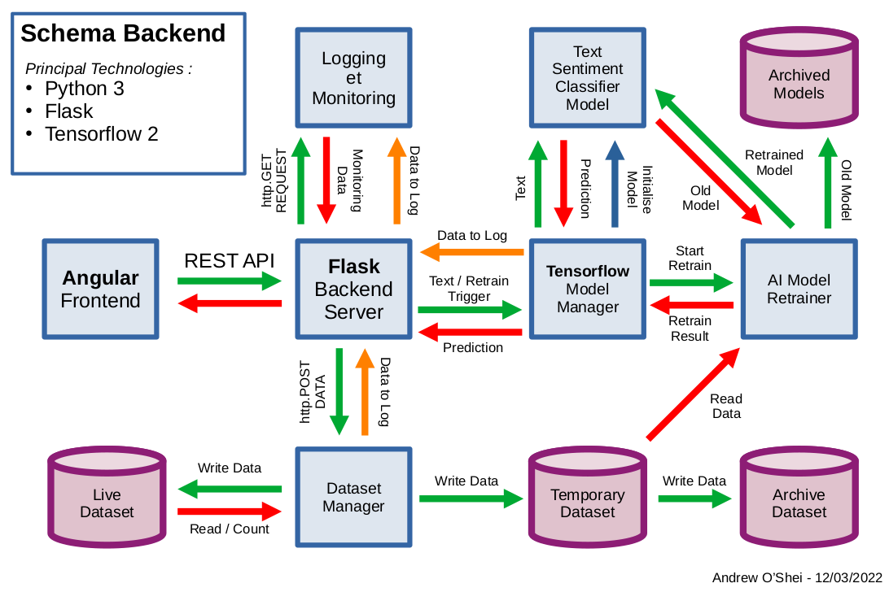

# SNTP

## SNTP Angular Frontend

This is the frontend of the application. In order to run the frontend first run the command `npm install` to install the project dependecies. Then launch with `npm start`.

## TF Model Flask

This is a reimplementation of the 'TF Inference Server', using the Flask backend micro-framework. Launch 'tf\_model\_flask/tf\_model\_server.py' to start the Flask server. This provides a RESTful API for running predictions on the AI Model, Adding new records to the dataset and retrieving monitor information. After 1000 new labeled text samples have been added to the dataset the AI retraining process will trigger automatically. The newly trained model will be compared with the old model. If the new model is better the old model will be archived and the new model will go live.

### REST API

#### 1. Make Prediction
- POST:		{action: "predict", text: "I'm lovin it"}
- RESPONSE:	{prediction: "positive", text: "I'm lovin it"}

#### 2. Record Data to Dataset
- POST:		{action: "record", prediction: "positive", text: "I'm lovin it"}
- RESPONSE:	{status: "success"}

#### 3. Retrieve Monitor Data
- GET:		{params: {target: "monitor_data"}}
- RESPONSE:	{logs: [ { timestamp: "2022-03-11 12:28:23", winner: "new", old: {loss: 0.32, accuracy: 0.87}, new: {loss: 0.29, accuracy: 0.89} }, ...] }

#### 4. Retrieve Most Recent Training Graph
- GET:		{params: {target: "monitor_graph"}}
- RESPONSE:	< PNG IMAGE >

## TF Model Trainer

This contains the cleaned dataset and training algorithm for the TF Sentiment Classifier Model.
